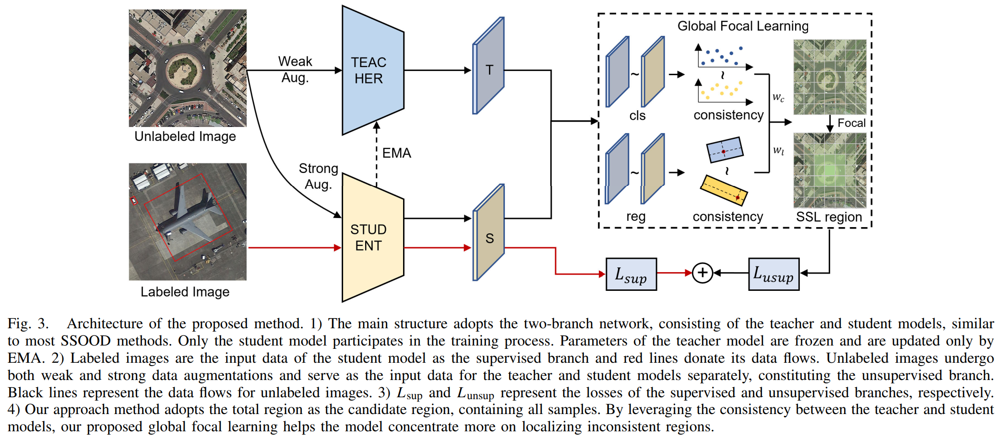

# Focal Teacher
An official implementation of "Global Focal Learning for Semi-Supervised Oriented Object Detection"[[Paper Link](https://ieeexplore.ieee.org/document/10623510)]


# Introduction
Oriented object detectors have achieved great success in aerial detection task with the help of ample labeled data. Unlabeled images are easier and less expensive to obtain than labeled aerial images. Therefore, semi-supervised oriented object detection~(SSOOD) is becoming a hot task, which can leverage both labeled and unlabeled data to train oriented detectors. Most SSOOD approaches focus on well-designed approaches to generate high-quality pseudo labels or positive learning regions, which are limited for complex and variable aerial scene. This study first analyzes key factors influencing the performance of SSOOD and proposes a global focal learning method~(termed as Focal Teacher) without artificial priori design. It rely on global region and soft regression approaches to blur the boundaries between positive and negative samples, mainly through Localization Focal Loss to achieve. It leverages the localization consistency between teacher and student model to focus more on hard regions. Moreover, we organize a large remote sensing unlabeled dataset to exploit the performance potential of oriented detectors on mainstream aerial detection datasets~(DOTA and DIOR). Adequate experiments reveal that the proposed method achieves the best performance compared with other mainstream SSOOD methods, including partly, fully and additionally data settings on DOTA and DIOR datasets. Semi-supervised mechanism without preset learning regions can be better applied in dense and complex aerial scenes.

# Install
Core packages are listed below. For detailed installation instructions, please refer to [MMRotate v0.3.4](https://github.com/open-mmlab/mmrotate/tree/v0.3.4).
```
mmcv-full=1.7.1, mmdet=2.28.2, mmrotate=0.3.4, torch=1.12.0+cu102
```

# Training
Code and Config are now available. You could train FocalTeacher with the following command:
```
./tools/dist_train.sh configs/ft_fcos/ft_fcos_dota15_10per.py 2
```
Or train other configs via configs in `./configs/ft_fcos/`.

## Data preparation
For partial labeled setting and fully labeled setting, please follow the pipeline in [SOOD](https://github.com/HamPerdredes/SOOD).

For additional setting, we use DOTA-v1.0 trainval, DOTA-v1.5 trainval and DIOR trainval as labeled sets and [RSUL](https://github.com/heiyuxiaokai/RSUL) as unlabeled set, the model is evaluated on corresponding test sets.

Details about split DOTA into patches, please follow [MMRotate's official implementation](https://github.com/open-mmlab/mmrotate/blob/main/tools/data/dota/README.md).

After split, the data folder should be organized as follows, we further need to create empty annotations files for unlabeled data via `tools/data/dota/create_empty_annfiles.py`.
```
split_ss_dota_v15
├── train
│   ├── images
│   └── annfiles
├── val
│   ├── images
│   └── annfiles
├── train_xx_labeled
│   ├── images
│   └── annfiles
└──train_xx_unlabeled
    ├── images
    └── annfiles
```


## Citation

If you find this codebase helpful, please consider to cite:

```
@ARTICLE{wang2024global,
  author={Wang, Kai and Xiao, Zhifeng and Wan, Qiao and Xia, Fanfan and Chen, Pin and Li, Deren},
  journal={IEEE Transactions on Geoscience and Remote Sensing}, 
  title={Global Focal Learning for Semi-Supervised Oriented Object Detection}, 
  year={2024},
  doi={10.1109/TGRS.2024.3438844}
}
```